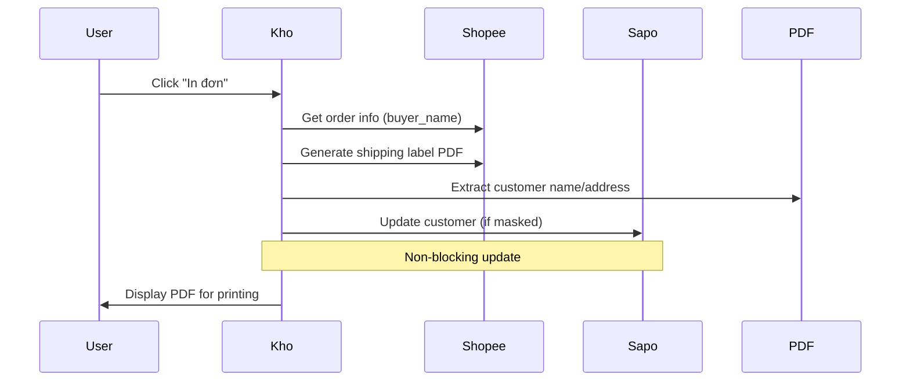

# Kho Module

Module quản lý kho và xử lý đơn hàng.

## Features

### Order Printing with Customer Auto-Update (UPDATED)

**File:** `views/orders.py` - `print_now()` function

**New Integration:**
Khi in đơn Shopee, system tự động update thông tin khách hàng từ:
1. **Shopee username** → `customer.website`
2. **PDF shipping label** → `customer.name` (nếu bị mask)

**Workflow Updates:**
```python
def print_now(request):
    # ... existing code ...
    
    # After PDF generation
    shopee_order_info = client.get_shopee_order_id(channel_order_number)
    
    # Auto-update customer (non-blocking)
    if pdf_bytes and dto and dto.customer_id:
        update_customer_from_shopee_data(
            customer_id=dto.customer_id,
            shopee_order_info=shopee_order_info,
            pdf_bytes=pdf_bytes
        )
    
    # ... continue with printing ...
```

**Key Points:**
- ✅ Non-blocking: Update errors don't stop printing
- ✅ Automatic: No manual intervention needed
- ✅ Smart: Only updates masked data
- ✅ Logged: All actions logged for debugging

## Order Processing Flow



## Configuration

No additional configuration required. Feature auto-activates for all Shopee orders.

## Monitoring

Check logs for customer update status:
```
[CustomerService] Updating username for customer 846791668: ngocvuongdn95
[CustomerService] Will update masked name for customer 846791668
```

## Dependencies

- `orders.services.shopee_print_service` - Shopee PDF generation
- `orders.services.customer_update_helper` - Customer update logic
- `customers.services` - Customer data management
- `core.shopee_client` - Shopee API integration
