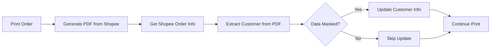

# Orders Module

Module xử lý đơn hàng từ Sapo Marketplace và Shopee.

## Features

### 1. PDF Customer Extraction (NEW)
Trích xuất thông tin khách hàng từ PDF phiếu gửi hàng Shopee với độ chính xác cao.

**File:** `services/pdf_customer_extractor.py`

**Chức năng:**
- ✅ Column-aware parsing: Phân biệt cột "Từ:" (shop) và "Đến:" (khách)
- ✅ Extract customer name từ PDF (loại bỏ shop prefix)
- ✅ Extract customer address (chỉ address1, loại bỏ administrative divisions)
- ✅ Skip masked data (`*****`)
- ✅ Support multiple carriers: SPX, GHN, J&T, Ninja, Best Express, Ahamove

**Usage:**
```python
from orders.services.pdf_customer_extractor import extract_customer_info_from_pdf

# Extract từ PDF bytes
customer_info = extract_customer_info_from_pdf(pdf_bytes)
# Returns: {"name": "Hoàng Thắm", "address": "448/25 Phan Huy Ich"}
```

**Test Results:** 5/5 sample PDFs extracted correctly ✅

### 2. Customer Update Helper (NEW)
Non-blocking helper để auto-update customer info during print workflow.

**File:** `services/customer_update_helper.py`

**Function:** `update_customer_from_shopee_data(customer_id, shopee_order_info, pdf_bytes)`

**Workflow:**
1. Update Shopee username → `customer.website`
2. Extract customer info from PDF
3. Update name nếu data bị masked (`*****`)
4. Log all errors (không throw exception)

**Design:** Non-blocking - in đơn vẫn thành công dù customer update fail.

### 3. Shopee Print Service Updates
**File:** `services/shopee_print_service.py`

**Breaking Change:**
```python
# OLD
shopee_order_id = client.get_shopee_order_id(order_sn)  # Returns: int

# NEW  
shopee_order_info = client.get_shopee_order_id(order_sn)  # Returns: Dict
shopee_order_id = shopee_order_info["order_id"]
buyer_name = shopee_order_info["buyer_name"]  # Username available
```

**Caller Updates:**
- ✅ `orders/services/shopee_print_service.py` - Updated
- ✅ `kho/views/orders.py` - Updated with customer auto-update integration

## Integration Flow



## Dependencies

- `pdfplumber` - PDF parsing
- `PyPDF2` - PDF manipulation
- `core.shopee_client` - Shopee KNB API
- `core.sapo_client` - Sapo Core API
- `customers.services` - Customer update logic
